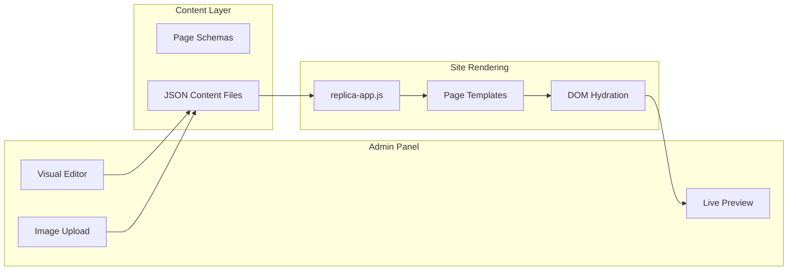
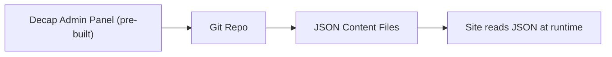
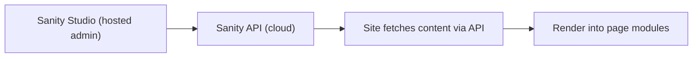

# Headless CMS for Velocity -- Options and Trade-offs

## The Core Challenge

Your pages are currently **static HTML modules** loaded by a JS router. A CMS needs to make parts of that HTML dynamic -- driven by editable data rather than hardcoded markup. The key question is how much refactoring the existing pages require.

---

## Option 1: Custom Lightweight CMS Built Into Local Replica

**Difficulty: Medium-High | Timeline: 2-3 weeks of focused work**

Build a self-contained admin panel and content layer directly into the project. No external services.




**How it works:**

1. **Define content schemas** per page -- each page gets a JSON schema that describes its editable fields:

```javascript
// content/schemas/home.json
{
  "hero": {
    "title": { "type": "text", "label": "Hero Title" },
    "subtitle": { "type": "textarea", "label": "Subtitle" },
    "background": { "type": "image", "label": "Hero Background" }
  },
  "promoCards": {
    "type": "repeater",
    "label": "Promo Cards",
    "fields": {
      "title": { "type": "text" },
      "image": { "type": "image" },
      "cta_text": { "type": "text" },
      "cta_link": { "type": "url" }
    }
  }
}
```

1. **Mark editable regions** in existing page HTML with data attributes:

```html
<h1 data-cms="hero.title">Velocity Sim Racing Lounge</h1>

```

For repeaters (like promo cards), the first card acts as a template; the CMS clones it for each entry.

1. **Content stored as JSON files** in a `content/` folder -- one per page. These are what the admin panel edits.
2. **Runtime hydration** -- a small JS layer runs after the page loads, finds `data-cms` attributes, and replaces content from the JSON files. Existing HTML stays intact as the fallback.
3. **Admin panel** -- a separate `admin.html` page with:
  - Sidebar listing all pages
  - Form fields auto-generated from schemas (text inputs, image uploaders, repeater add/remove)
  - Live preview iframe showing changes in real-time
  - "Save" writes updated JSON back to `localStorage` (or to disk via a tiny Node script)

**Pros:**

- Fully self-contained, no external accounts or services
- You own everything
- Works offline
- Minimal refactoring of existing pages (add `data-cms` attributes, not rewrite)

**Cons:**

- The admin UI is the big build -- form builder, image handling, repeater logic, drag-to-reorder
- Saving to actual files (not just localStorage) requires a small local server
- No user auth (anyone with the URL can edit)
- You maintain all of it

---

## Option 2: Decap CMS (formerly Netlify CMS)

**Difficulty: Medium | Timeline: 1 week**

An open-source, Git-backed CMS that gives you a polished admin panel out of the box.




**How it works:**

- You add a single `admin/index.html` to your project that loads Decap's pre-built React admin
- Define your content models in a `config.yml` (similar to the schemas above)
- Editors log in, edit content through a clean UI, and changes are committed as JSON/Markdown files to your Git repo
- Your page JS reads these files and hydrates the DOM

**Pros:**

- Admin UI is already built -- clean, supports text, images, repeaters, drag-reorder
- Free, open source
- Content lives in your Git repo (version controlled, rollback-able)
- Supports media uploads (to Git or external like Cloudinary)

**Cons:**

- Requires Git as a backend (GitHub/GitLab) -- your project isn't a Git repo currently
- Needs a Git gateway or Netlify Identity for auth
- Less flexible than custom -- you work within their content model patterns
- Still need the `data-cms` hydration layer on the front end

---

## Option 3: Sanity.io (Hosted Headless CMS)

**Difficulty: Medium | Timeline: 1 week**

A hosted CMS with a very polished admin panel (Sanity Studio), a generous free tier, and real-time API.




**How it works:**

- Set up a Sanity project (free for 3 users, 500K API requests/mo)
- Define content schemas in their Studio
- Your page JS fetches content from Sanity's API and hydrates the DOM
- Studio is fully customizable, supports images, rich text, arrays of objects (cards), references between pages

**Pros:**

- Best admin UX of any option -- non-technical users will find it intuitive
- Real-time preview, collaboration, version history built-in
- Image CDN with on-the-fly transforms (resize, crop)
- Scales to production without changes

**Cons:**

- External service dependency (content lives in Sanity's cloud)
- API calls required (needs network, adds latency)
- Free tier has limits (eventually paid)
- Vendor lock-in risk

---

## Option 4: TinaCMS (Visual Inline Editing)

**Difficulty: Medium-High | Timeline: 1-2 weeks**

Edit content directly on the page -- click on a headline, type the new text, save.

**Pros:** Most intuitive editing experience possible -- "click and type"
**Cons:** Requires React/Next.js setup, significant refactor of your static HTML approach, their cloud service for the editing API

---

## Honest Difficulty Comparison

- **Option 1 (Custom):** Most work upfront, but most flexibility and zero dependencies. The hardest part is building the admin UI well enough for non-technical users. Probably 500-800 lines of JS for the admin + 100 lines for the hydration layer + schema files per page.
- **Option 2 (Decap):** Moderate work. You get the admin for free but need to set up Git hosting and build the front-end hydration layer. Main blocker: your project isn't in Git yet.
- **Option 3 (Sanity):** Fastest to a polished result. Admin panel is world-class. Trade-off is external dependency and API-based content fetching. Good if you want this to scale to the production site.
- **Option 4 (Tina):** Best UX but biggest architectural change. Not a great fit for your current static HTML setup.

## Recommendation

**If you want to stay self-contained:** Option 1 (Custom). I can build it. The admin won't be as polished as Sanity's Studio, but it'll be functional, clean, and yours.

**If you want the best result fastest:** Option 3 (Sanity). Set up a free project, define schemas, and I build the hydration layer. Non-technical users will love the editing experience.

**If you want version control:** Option 2 (Decap). But first step would be initializing your project as a Git repo.

What direction appeals to you?