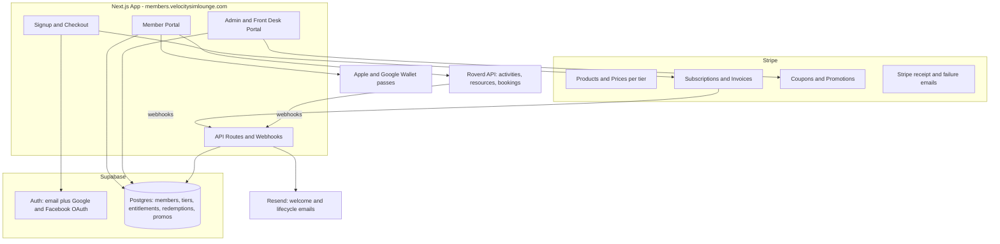

# Velocity Membership Platform Redesign

## Summary

Replace the current members portal with a custom web app at `members.velocitysimlounge.com`:

- **Stack**: Next.js (App Router, Vercel) + Supabase (Auth, Postgres, RLS) + Stripe (Billing/Subscriptions) + Roverd (bookings)
- **New repo/project** — separate from this static marketing-site workspace (e.g. `velocity-members`)
- Three user surfaces: **Member portal**, **Front desk/Admin portal**, **Public signup flow**
- Launch target: **July 11, 2026** (per press release). P0s are launch blockers; P1s are fast follows.

## Architecture

## Data model (Supabase Postgres)

- `profiles` — linked to Supabase auth user; name, email, phone, birthday, home location (Houston/Dallas), `stripe_customer_id`, role (`member` / `front_desk` / `admin`)
- `membership_tiers` — name, `stripe_price_id`, monthly session allowance, booking discount %, allowed rig types, designated days, allowed locations, benefit flags (admin-editable per P0 admin requirement)
- `memberships` — profile, tier, status (active/past_due/deactivated), `stripe_subscription_id`, joined_at, deactivated_at
- `session_redemptions` — membership, month, Roverd booking id/link, redeemed_at. **Remaining sessions are computed**: tier allowance minus redemptions in the current calendar month (no rollover, resets on the 1st — no cron needed)
- `promotions` — maps to Stripe coupons (e.g. 50% off first month, 30% off for 12 months)
- `audit_log` — staff actions (deactivations, promo grants)

RLS: members read/write only their own rows; staff roles gated via JWT claims.

## Stripe design

- One Product per tier; monthly Prices: Racer $99, Pro $169, Ultimate $299 (+ automatic tax via Stripe Tax)
- **Signup**: Stripe Checkout in subscription mode, created after Supabase signup; `checkout.session.completed` webhook activates membership
- **Self-service management**: Stripe Customer Portal with a restricted configuration — payment-method update only, **cancel/pause disabled** (per requirements). Profile fields (birthday/email/phone) edited in our portal
- **Webhooks**: `invoice.paid` (keep active), `invoice.payment_failed` / `customer.subscription.updated` (past_due handling), `customer.subscription.deleted` (deactivate)
- **Promos**: Stripe Coupons + Promotion Codes (`duration: repeating` covers "30% off for 12 months"); admin UI wraps coupon creation/attachment
- **Deactivation** (staff): cancel subscription via API + mark membership deactivated
- **Migration**: enumerate existing Stripe customers/subscriptions from the old portal's Stripe account, map each to a tier, backfill `profiles`/`memberships`, and send a one-time "set your password / claim your account" email. If the new platform uses the same Stripe account, subscriptions keep billing uninterrupted — no card re-entry

## Roverd integration (API confirmed — docs reviewed)

[Roverd API v1 docs](https://www.roverd.com/wp-content/api_documentation.html) confirm everything needed to book from our own UI. No widget/promo-code fallback required.

- **Auth**: `POST /api/v1/user/login` issues a bearer token (server-side only, stored as env secret). The API user needs the `Manage Bookings` permission. Token validity checked via `GET /user/checkTokenValidity`; refresh on expiry
- **BOOK NOW flow**:
  1. `GET /activity` — resolve the Quick Race activity per location (cached; admin maps tier → allowed Roverd `ActivityCode`s)
  2. `GET /availability` with `ActivityCode` + date range — show open slots, filtered client-side by the tier's designated days (schedules expose per-day flags and capacity)
  3. `POST /booking` with `Payment.Amount: "0.00"`, member's name/email/phone as lead traveller, and our own `BookingReference` (set to our redemption UUID) — creates the complimentary booking
  4. Insert `session_redemption` row with the returned Roverd booking id; dashboard count decrements
- **Reconciliation**: nightly job + on-demand `GET /booking?status[]=...` list to catch front-desk cancellations/changes; `POST /booking/cancel/:id` lets members cancel a booked session and reclaim the credit (subject to schedule cutoff). Roverd webhooks (if enabled on the account) replace polling
- **Roverd config prerequisites** (done in Roverd dashboard, not code): a Quick Race activity per location, schedules covering open hours, and an API user with Manage Bookings permission
- Discounted post-allowance bookings (P1): same flow but `Payment.Amount` = member-discounted price, collected via Stripe PaymentIntent before the Roverd booking is created

## Member portal (P0)

- Signup/login: email+password, Google, Facebook (Supabase Auth)
- Subscribe flow: pick tier → Stripe Checkout → welcome screen
- Dashboard: tier, status, **sessions remaining this month**, next billing date
- BOOK NOW flow (Quick Races only, gated by remaining sessions)
- Manage: update card (Stripe Portal), update birthday/email/phone (our UI). No cancel/pause
- Tier changes: self-serve upgrade (immediate, prorated, allowance bumps now) and downgrade (effective next billing cycle)
- **Digital wallet member ID**: Apple Wallet (PassKit signing cert via Apple Developer account) + Google Wallet pass with name, tier, status; pass updated/revoked on status change. Plus an in-portal fallback "membership card" screen for Toast discount redemption

## Front desk / Admin portal (P0)

- Member list: active/inactive filter, sort by join date / last name / status; columns: name, email, phone, joined, deactivated, sessions remaining, Roverd booking links
- CSV export of member data
- Deactivate membership (with confirmation + audit log)
- Tier management: edit benefits, allowances, discounts, pricing (syncs Stripe Prices)
- Promotions: create/apply discounts for X period (P1 in doc, but cheap to include since it wraps Stripe coupons)

## Notifications

- Stripe handles: payment receipts, failed-payment emails, card-expiry reminders (enable in Stripe settings)
- Resend (or similar) for: welcome email, cancellation/deactivation notice, claim-your-account migration email
- P1: admin broadcast email to all members

## Phasing

- **Phase 1 — Foundation**: repo, Next.js + Supabase scaffold, schema, auth (email/Google/FB), Stripe products/checkout/webhooks
- **Phase 2 — Member portal**: dashboard, session tracking, profile management, restricted Stripe portal
- **Phase 3 — Booking**: Roverd client (auth, availability, create/cancel booking), BOOK NOW flow, redemption tracking, reconciliation job
- **Phase 4 — Staff portal**: member list/sort/export, deactivation, tier + promo management
- **Phase 5 — Wallet + notifications**: Apple/Google passes, Resend emails
- **Phase 6 — Migration + launch**: migrate existing Stripe members, DNS cutover for `members.velocitysimlounge.com`, QA

## Edge cases and policies

Policy decisions (confirmed with owner):

- Billing anchor: full price billed on signup anniversary; sessions always reset on the 1st (calendar month). No proration
- Cross-month pre-booking: allowance is consumed from the race-date's month, not the booking-date's month
- Tier changes: self-serve in portal — upgrades immediate with Stripe proration and instant allowance bump; downgrades take effect next billing cycle
- No-cancel policy: chargeback/legal risk under card-network and auto-renewal rules; require explicit checkout terms plus a documented same-day front-desk cancel path; legal review before launch (still open)
- Past-due grace: 7-day grace — booking still allowed with a fix-payment banner, redemptions suspended after; deactivation cancels future $0 Roverd bookings
- Price changes grandfather existing subscribers (Stripe default via new Price objects)

Technical edge cases (handled in design):

- Redemption race conditions: lock membership row in a transaction before calling Roverd
- Partial failure between Roverd and our DB: idempotency via redemption UUID as BookingReference plus reconciliation job
- Cancellations vs no-shows: within-cutoff cancellation returns the credit; no-show consumes it; reconciliation detects cancellations made directly in Roverd by staff
- Month rollover computed in America/Chicago, not UTC
- Wallet pass staleness: QR on pass resolves to live status check endpoint; push pass updates are a fast-follow
- Account collisions: OAuth/email identity linking; migration matches existing Stripe customers by email
- Email changes propagate to Stripe customer, wallet pass, and future Roverd bookings
- Admin-managed blackout dates (holidays, Member Day, private events) excluded from free redemption
- Tier-to-Roverd ActivityCode mapping is admin-editable; confirm rig modeling (activities vs resources) per location
- Idempotent Stripe webhook handlers (Stripe retries deliveries)
- Promo redemption capped per customer to prevent cancel/re-signup abuse
- One active membership per account (uniqueness constraint)

## Open items to resolve during build

- Roverd account setup: API user with Manage Bookings permission + credentials (`host` is per-install, e.g. velocity's Roverd domain); confirm whether webhooks are enabled on the account (otherwise use polling reconciliation)
- Stripe access: need API keys for the existing Stripe account (user does not have these yet) — also determines migration approach for existing subscribers
- Apple Developer account + pass-signing certificate for Apple Wallet (lead time, needs Apple account access)
- Facebook login requires a Meta app review for production — start early

